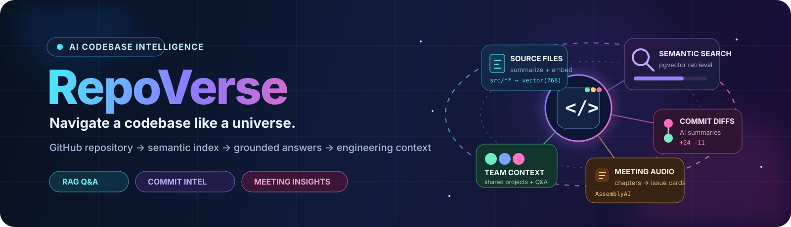
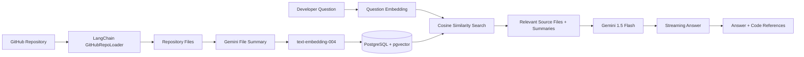
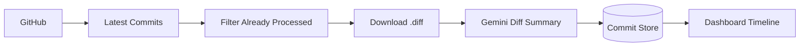
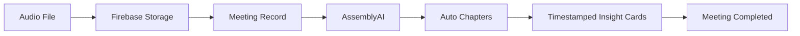
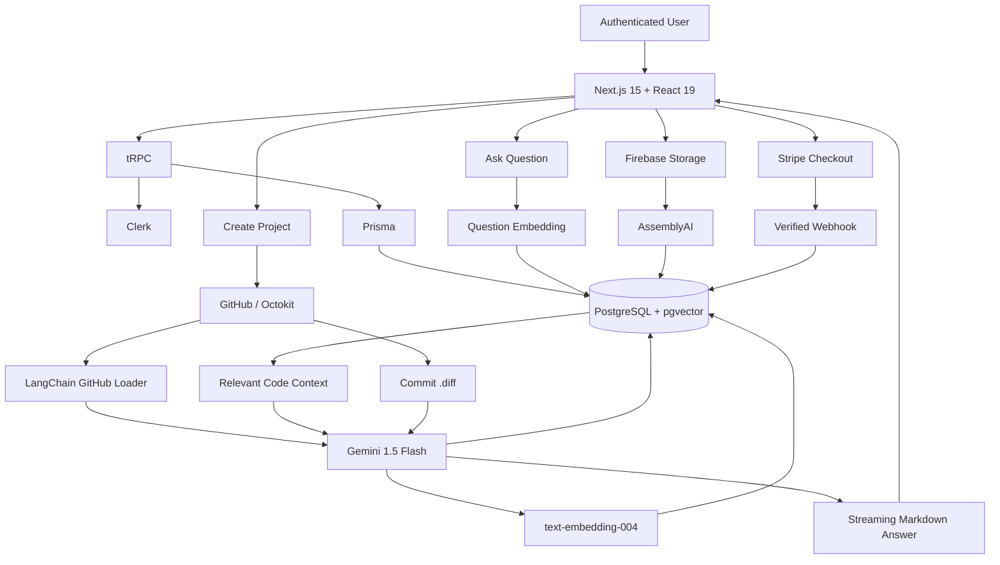
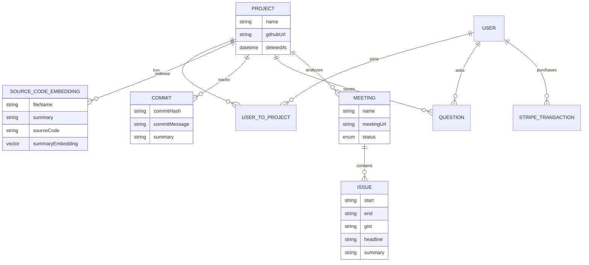

<div align="center">
  
</div>

<br/>

<div align="center">

# RepoVerse

### AI-powered codebase intelligence for GitHub repositories.

[](https://nextjs.org/)
[](https://react.dev/)
[](https://www.typescriptlang.org/)
[](https://ai.google.dev/)
[](https://js.langchain.com/)
[](https://www.postgresql.org/)
[](https://www.prisma.io/)
[](https://clerk.com/)
[](https://www.assemblyai.com/)
[](https://stripe.com/)

**Repository RAG · Grounded code Q&A · File references · Commit intelligence · Meeting analysis · Team workspaces**

</div>

---

## 🌌 What is RepoVerse?

Large repositories are difficult to understand when you are new to a codebase.

**RepoVerse turns a GitHub repository into an AI-assisted engineering workspace.**

Link a repository and RepoVerse recursively loads its source files, summarizes them with Gemini, converts those summaries into vector embeddings, and stores them in PostgreSQL with `pgvector`.

You can then ask questions such as:

```text
Which file controls authentication?

Where should I change the dashboard UI?

How does this repository fetch GitHub commits?

Which files are relevant to meeting processing?
```

RepoVerse retrieves the most semantically relevant files, sends their source code and summaries to Gemini as grounded context, streams the answer to the UI, and shows the exact code references used.

But repository Q&A is only one part of the product.

RepoVerse also summarizes recent Git commit diffs, turns uploaded engineering-meeting audio into timestamped discussion insights, supports shared projects, and includes a credit-based SaaS flow.

---

# ⚡ 30-second recruiter overview

| System | What RepoVerse implements |
|---|---|
| **Codebase RAG** | GitHub ingestion → Gemini file summaries → embeddings → pgvector retrieval → grounded answers |
| **Code References** | Retrieved files are displayed alongside the AI response with syntax highlighting |
| **Commit Intelligence** | Pulls recent GitHub commits, downloads diffs, summarizes code changes with Gemini |
| **Meeting Intelligence** | Uploads engineering meeting audio and converts it into timestamped topic/issue cards |
| **Team Collaboration** | Shareable project invite links, project membership, member avatars, saved Q&A |
| **SaaS Infrastructure** | Clerk authentication, credit metering, Stripe Checkout, verified payment webhooks |
| **Full-Stack Architecture** | Next.js 15, React 19, TypeScript, tRPC, Prisma, PostgreSQL, TanStack Query |

---

# 🧠 The core: repository-aware RAG

RepoVerse does not ask an LLM to guess about a repository from a repository name.

It builds a semantic index from the code itself.



### Indexing pipeline

When a project is created:

1. RepoVerse counts the files in the repository.
2. The GitHub repository is loaded recursively from the `main` branch.
3. Lockfiles are excluded from indexing.
4. Each loaded file is summarized by Gemini.
5. Each summary is embedded using `text-embedding-004`.
6. The source code, filename, summary, and embedding are persisted.
7. The user's credits are reduced by the repository file count.

The Prisma schema stores the embedding as:

```text
vector(768)
```

This makes semantic code retrieval a first-class database operation rather than an in-memory demo.

---

# 💬 Ask the codebase

The Q&A flow embeds the developer's question and performs similarity search directly against the repository's stored vectors.

The current retrieval query:

- uses pgvector cosine distance,
- filters by the selected project,
- requires similarity above `0.5`,
- returns up to `10` relevant files.

Those results become the context block for Gemini.

The model is explicitly instructed to:

- answer from the supplied repository context,
- give detailed code explanations when relevant,
- avoid inventing answers outside the retrieved context,
- return Markdown and code snippets when useful.

The answer is streamed to the interface as it is generated.

### Code references are part of the answer experience

RepoVerse does not stop at generated prose.

For every retrieved file, the UI can show the original source in dedicated tabs with syntax highlighting.

```text
Question
   ↓
Semantic retrieval
   ↓
Streaming answer
   +
Referenced files
   +
Original source code
```

Developers can also **save answers** together with the file references that supported them.

---

# 🔀 Commit intelligence

Understanding a codebase also means understanding how it is changing.

RepoVerse polls the repository's recent commit history using Octokit.



For unprocessed commits, RepoVerse:

1. retrieves the commit metadata,
2. downloads the raw Git diff,
3. asks Gemini to summarize the actual code changes,
4. stores the result,
5. displays the commit message, author, avatar, and AI summary in the project dashboard.

The implementation currently works with the **latest 10 commits** returned for the repository.

---

# 🎙️ Turn engineering meetings into structured context

RepoVerse can also analyze project-related meeting recordings.

Supported uploads in the UI include:

```text
.mp3
.wav
.m4a
```

with a maximum upload size of **50 MB**.

### Meeting pipeline



The uploaded file is stored in Firebase Storage and processed with AssemblyAI using automatic chapters.

Each generated segment is persisted with:

- start time,
- end time,
- gist,
- headline,
- summary.

The meeting view then renders these segments as individual discussion/issue cards.

This gives teams a compact way to revisit important parts of technical conversations without replaying the entire recording.

---

# 👥 Shared project context

RepoVerse models projects separately from users through a `UserToProject` relationship.

A project workspace includes:

- linked GitHub repository,
- indexed source-code knowledge,
- commit summaries,
- saved questions,
- uploaded meeting insights,
- team-member avatars.

Users can generate a project-specific invitation URL:

```text
/join/{projectId}
```

When another authenticated user opens the link, RepoVerse adds that user to the project membership table.

---

# 💳 Credit-based repository indexing

Repository indexing has a measurable AI-processing cost, so RepoVerse includes a simple credit system.

### Current implementation

```text
New user balance: 150 credits
1 repository file: 1 credit
```

Before project creation, RepoVerse recursively counts repository files through the GitHub API and compares that count with the user's available credits.

If enough credits are available:

```text
Repository file count
        ↓
Credit check
        ↓
Index repository
        ↓
Deduct credits
```

Additional credits can be purchased through Stripe Checkout.

The Stripe webhook verifies the event signature before recording the transaction and incrementing the user's credit balance.

---

# 🏗️ System architecture



---

# 🔧 Engineering details

### Semantic retrieval lives in PostgreSQL

RepoVerse enables PostgreSQL's vector extension and stores embeddings directly beside repository metadata.

This keeps repository, question, commit, meeting, user, and vector data within one relational data model.

### AI answers are streamed

The application uses the AI SDK's streaming primitives so the user can begin reading while Gemini is still generating the rest of the response.

### Commit summaries use the real diff

Rather than summarizing only a commit message, RepoVerse fetches:

```text
{githubUrl}/commit/{commitHash}.diff
```

and asks Gemini to explain the actual changes.

### Meeting processing is asynchronous from the upload UI

After the file is uploaded and the meeting record is created, the UI triggers the processing endpoint separately and navigates to the meeting area while processing continues.

### Protected application routes

Clerk middleware protects the application outside the public sign-in/sign-up routes and the Stripe webhook endpoint, while tRPC project procedures use an authenticated middleware.

### Verified payment events

Stripe webhook signatures are validated with the configured webhook secret before credits are added.

---

# 🛠️ Tech stack

| Layer | Technology |
|---|---|
| **Frontend** | Next.js 15, React 19, TypeScript |
| **UI** | Tailwind CSS 4, shadcn/ui, Radix UI, Lucide |
| **API** | tRPC 11, Zod |
| **Client Data** | TanStack Query |
| **Database** | PostgreSQL, pgvector |
| **ORM** | Prisma |
| **Authentication** | Clerk |
| **Repository Ingestion** | LangChain `GithubRepoLoader` |
| **GitHub Integration** | Octokit, GitHub API |
| **LLM** | Gemini 1.5 Flash |
| **Embeddings** | Gemini `text-embedding-004` |
| **AI Streaming** | Vercel AI SDK / AI SDK RSC |
| **Meeting Transcription** | AssemblyAI |
| **Meeting Storage** | Firebase Storage |
| **Payments** | Stripe Checkout + webhooks |

---

# 📦 Data model

RepoVerse connects several kinds of engineering context around a single project.



---

# 📁 Repository structure

```text
RepoVerse/
├── prisma/
│   └── schema.prisma
│
├── public/
│   ├── logo.png
│   └── undraw_github.png
│
├── src/
│   ├── app/
│   │   ├── (protected)/
│   │   │   ├── dashboard/      # RAG Q&A, commits, teams, meeting upload
│   │   │   ├── create/         # GitHub repository onboarding
│   │   │   ├── qa/             # Saved questions
│   │   │   ├── meetings/       # Meeting insights
│   │   │   ├── billing/        # Credit purchases
│   │   │   └── join/           # Project invitations
│   │   └── api/
│   │       ├── process-meeting/
│   │       ├── trpc/
│   │       └── webhook/stripe/
│   │
│   ├── lib/
│   │   ├── gemini.ts           # Summaries + embeddings
│   │   ├── github-loader.ts    # Repository loading + indexing
│   │   ├── github.ts           # Commit polling + diff summaries
│   │   ├── assembly.ts         # Meeting chapter analysis
│   │   ├── firebase.ts         # Meeting upload
│   │   └── stripe.ts           # Checkout
│   │
│   ├── server/
│   │   ├── api/
│   │   └── db.ts
│   │
│   └── trpc/
│
└── package.json
```

---

# 🚀 Run locally

## 1. Clone the repository

```bash
git clone https://github.com/Ankita2525/RepoVerse.git
cd RepoVerse
npm install
```

## 2. Configure PostgreSQL

RepoVerse requires PostgreSQL with the `vector` extension enabled.

The Prisma datasource expects:

```text
DATABASE_URL
```

The checked-in `.env.example` currently documents this database value.

## 3. Configure the services referenced by the source

The current code directly references these additional environment variables:

```text
GEMINI_API_KEY
GITHUB_TOKEN
ASSEMBLYAI_API_KEY
STRIPE_SECRET_KEY
STRIPE_WEBHOOK_SECRET
NEXT_PUBLIC_APP_URL
```

Clerk also needs to be configured for authentication in the environment where the application runs.

Firebase Storage configuration is currently defined in:

```text
src/lib/firebase.ts
```

> Never commit real secrets or private GitHub tokens to the repository.

## 4. Push the database schema

```bash
npm run db:push
```

## 5. Start development

```bash
npm run dev
```

---

# ✅ Implemented in this repository

- GitHub repository linking
- optional GitHub token input for repository loading
- recursive repository file counting
- credit check before indexing
- recursive GitHub repository ingestion
- Gemini file summarization
- Gemini embedding generation
- PostgreSQL `pgvector` storage
- semantic code retrieval
- streaming codebase Q&A
- grounded-answer prompting
- source-code references with syntax highlighting
- saved Q&A history
- recent Git commit polling
- Git diff summarization
- commit timeline
- project switching
- project archiving
- project invite links
- team-member display
- audio meeting uploads
- Firebase Storage upload progress
- AssemblyAI automatic chapter analysis
- timestamped meeting insight cards
- Clerk authentication
- Stripe Checkout
- verified Stripe webhooks
- credit transaction tracking

---

# 🧭 Natural next engineering steps

The existing architecture provides several clear expansion paths:

- semantic code chunking instead of one summary embedding per loaded document,
- hybrid lexical + vector retrieval,
- reranking before LLM generation,
- repository-wide conversation history,
- background job orchestration for large repository indexing,
- GitHub App/OAuth installation flow for private repositories,
- richer project-level roles and authorization,
- branch selection instead of a fixed `main` branch,
- automated retrieval and answer-quality evaluation,
- tests and observability around indexing, retrieval, and payment workflows.

---

# ✨ Why RepoVerse?

A repository is more than a folder of source files.

It is a combination of:

```text
Source code
   +
Architecture
   +
Commit history
   +
Developer questions
   +
Team knowledge
   +
Technical conversations
```

RepoVerse brings those signals into one engineering workspace and adds an AI layer for navigating them.

> **Don't just search the repository. Understand the universe around it.**

---

<div align="center">

### Built by Ankita Khartmol

**AI/ML & Software Engineer · MS Computer Science, USC**

RAG systems · Agentic AI · Full-stack products · Production ML

</div>
